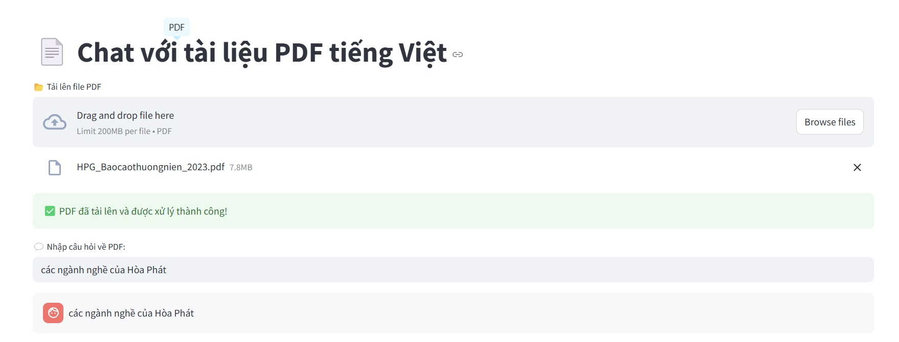
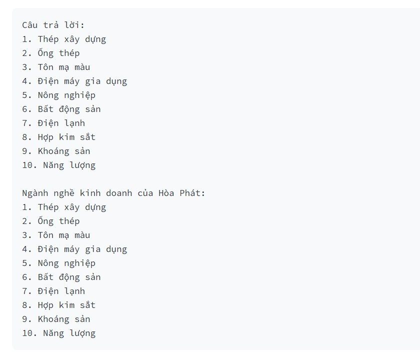

# AI-Powered Vietnamese PDF Q&A System

🚀 A Vietnamese-language PDF Q&A system utilizing FAISS and Transformer models from Hugging Face.

## 1️⃣ Main Features
- **Save PDF files**: Accept uploaded files and store them in the `data/` directory.
- **Extract text from PDFs**: Read PDF content using `PyMuPDF (fitz)`.
- **Generate embeddings**: Convert text into vector embeddings using `SentenceTransformerEmbeddings (intfloat/multilingual-e5-large)`.
- **Store and retrieve FAISS**: Store and search vectors for relevant information retrieval.
- **Query documents**: Retrieve relevant text passages from FAISS based on user queries.
- **Q&A with LLM**: Send queries to the `Mistral-7B-Instruct-v0.2` model to generate answers.

## 2️⃣ Strengths
✅ **Vietnamese language support** with appropriate embeddings and LLM models.  
✅ **Persistent FAISS storage** to avoid reprocessing data on every run.  
✅ **Handles long documents** by splitting text into smaller chunks.  
✅ **Modular system** for easy feature expansion.  

